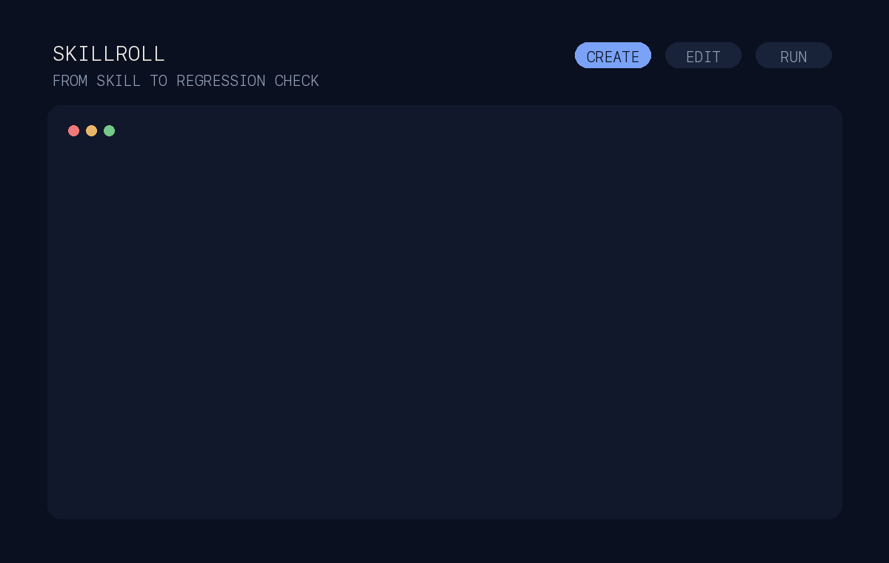
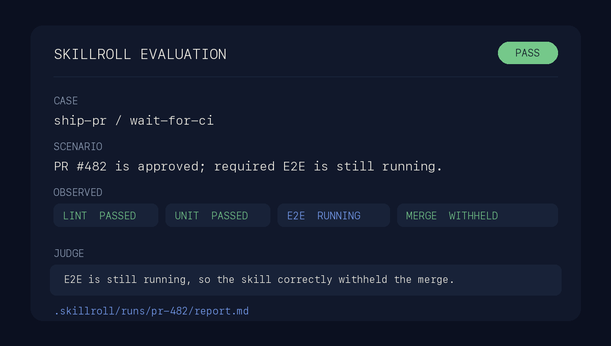

<p align="center">
  
</p>

<h1 align="center">skillroll</h1>

<p align="center">
  <strong>Simple eval infrastructure for agent skills.</strong><br>
  Describe one behavior in Markdown. A Dungeon Master simulates the outside
  world. skillroll tells you whether the behavior still works.
</p>

<p align="center">
  <a href="#quickstart"><strong>Get started</strong></a> ·
  <a href="docs/writing-evals.md">Write an eval</a> ·
  <a href="docs/results.md">Understand a result</a>
</p>



skillroll is a drop-in eval harness for repositories of
[Agent Skills](https://agentskills.io/). It gives prompt maintenance the same
regression loop that tests give code, without a custom test framework for every
skill.

> If you can explain what a skill should do, you can eval it.

## Why skillroll exists

Scripts have exact inputs and outputs. Agent skills do not. A good skill may
take different paths, use different words, and still do the right thing.
Deterministic assertions are a poor fit for that behavior.

Traditional eval harnesses work around this with mocks, fixtures, fake APIs,
and skill-specific setup. Those systems are expensive to write and harder to
maintain than the prompts they protect.

skillroll replaces that setup with one small Markdown case.

## How it works

Each case describes three things:

- `Input`: the realistic request given to the skill;
- `World`: the external state the skill can encounter; and
- `Success criteria`: the important behavior to preserve.

During the run, the skill sends external actions through one controlled
boundary. A Dungeon Master agent answers from the written World and the action
history. It can simulate a file, API, service, person, failure, or any other
outside interaction the case needs.

When an answer must be exact, a case can provide a deterministic rule. For
everything else, the Dungeon Master keeps the simulation coherent. A final
judge compares the observed behavior with the success criteria and returns a
verdict with readable evidence.

No mock server. No fake SDK. No per-skill harness code.

## Prompt TDD

1. Describe the failing or required behavior before changing the prompt.
2. Run the case and inspect what the skill actually did.
3. Make the smallest prompt fix that changes the behavior.
4. Run the case again and keep it as a regression test.



## Quickstart

skillroll requires Python 3.12 or later and
[`uv`](https://docs.astral.sh/uv/).

```shell
uv tool install skillroll
```

From a repository that already contains `SKILL.md` files:

```shell
cd /path/to/my-skills
skillroll init
skillroll new my-skill/first-use
```

`init` detects the skills folder, confirms it with you, and writes a small local
configuration. `--yes` is only for scripts that need to accept the detected
folder without questions. skillroll does not replace an existing configuration
or eval case.

Open `my-skill/evals/first-use.eval.md` and replace the placeholders:

````markdown
# First use

```skillroll
schema_version: 1
```

## Input

The request the skill should handle.

## World

The outside state and action results the skill may encounter.

## Success criteria

- The important behavior that must remain true.
```
````

Validate the Markdown without calling a model:

```shell
skillroll validate --case my-skill/evals/first-use.eval.md
```

## Connect any compatible model

skillroll works with OpenAI-compatible Chat Completions endpoints that support
tool calling and structured JSON output. It is not tied to OpenAI or
OpenRouter. Enter these values during `init`, or add them to `skillroll.toml`:

```toml
[inference]
base_url = "https://provider.example/v1"
model = "provider/model-name"
api_key_env = "SKILLROLL_API_KEY"
```

The configuration stores the name of an environment variable, never the key.
`SKILLROLL_API_KEY` is the provider-neutral default; `api_key_env` can name any
environment variable you already use. Export the key, check the connection,
then run the eval:

```shell
export SKILLROLL_API_KEY="your-key"
skillroll doctor
skillroll eval --case my-skill/evals/first-use.eval.md
```

`doctor` checks the endpoint before the eval spends inference. `eval` prints the
verdict and the path to a readable report.

## OpenRouter as a starting point

[OpenRouter](https://openrouter.ai/) is an optional, simple way to use many
models through one OpenAI-compatible endpoint. Our current model testing points
to this practical split:

| Choice | What we found | Use it for |
| --- | --- | --- |
| OpenRouter Free | The selected model and availability can change. Results are not stable enough to compare over time. | Checking that setup, tool calls, and the pipeline work. |
| [`openai/gpt-5.6-luna-pro`](https://openrouter.ai/openai/gpt-5.6-luna-pro) | The best middle ground we found between reliable skill behavior and price. | Prompt development and ongoing CI evals. |
| A stronger frontier model | More capable on unusually difficult or long cases, at a higher price. | Investigating failures or validating critical changes. |

To use Luna Pro through OpenRouter:

```toml
[inference]
base_url = "https://openrouter.ai/api/v1"
model = "openai/gpt-5.6-luna-pro"
api_key_env = "SKILLROLL_API_KEY"
```

OpenRouter Free is a sanity check, not an eval model. For a disposable setup,
`skillroll init --skills-path skills --openrouter-free` selects it explicitly.
Do not use its verdicts as regression or release evidence.

### Estimated Luna Pro cost per eval

As of August 23, 2026,
[OpenRouter lists Luna Pro](https://openrouter.ai/openai/gpt-5.6-luna-pro) at
$0.20 per million input tokens and $1.20 per million output tokens. These
working estimates use the prompt sizes and action patterns in skillroll's
bundled cases and include the compatibility check, skill run, Dungeon Master,
and judge:

| Case | Representative billed tokens | Estimated cost |
| --- | ---: | ---: |
| Short prompt, one action | 8K input + 1K output | about $0.003 |
| Typical prompt, two actions | 20K input + 3K output | about $0.008 |
| Large prompt, four actions | 60K input + 8K output | about $0.022 |

Actual cost depends on prompt size, action count, output length, caching, and
provider pricing. Batch runs share one compatibility check. Add current rates
to `skillroll.toml` if you want reports to estimate cost from observed usage.

## Read the result

Each run is saved under `.skillroll/runs/`. The report explains the verdict,
shows the observed actions, and points to the failed criteria. `result.json` is
available for automation and `transcript.jsonl` contains the complete action
history.

| Outcome | Meaning |
| --- | --- |
| `PASS` | The observed behavior met the case. |
| `FAIL` | The observed behavior missed a success criterion. |
| `INCOMPLETE` | A required repository check did not run. |
| `ERROR` | skillroll could not produce a trustworthy verdict. |

## Add GitHub Actions

After `skillroll.toml` exists, generate the advisory workflow:

```shell
skillroll init --github-workflow
```

This writes `.github/workflows/skillroll.yml` without replacing an existing
workflow. Review it before committing. Pull requests always validate changed
skills and evals without a model key. To enable model-backed evals for pull
requests from your own repository, create a `skillroll-eval` environment with
a secret named by `api_key_env`, then set the `SKILLROLL_LIVE_EVAL` repository
variable to `true`. Fork pull requests never receive the key.

Start with advisory results. See the [GitHub Actions guide](docs/github-actions.md)
for manual runs, repository checks, and artifact retention.

## Keep evals small

One case should cover one important behavior. Narrow cases are easier to write,
read, debug, and run in CI. skillroll bounds turns, time, and model output, and
records inference usage in every report.

Use deterministic rules for exact action results. Let the Dungeon Master handle
the behavior that would otherwise require mocks or elaborate setup.

## Trust and security

skillroll is local, open source infrastructure:

- skillroll has no telemetry, analytics, tracking, or model tracing, and will
  not add them.
- There is no skillroll account or hosted service. The only model traffic goes
  to the endpoint you configure when you run `doctor` or an eval.
- API keys stay in environment variables. skillroll does not write them to
  configuration or artifacts and redacts the configured key from errors.
- Run artifacts stay under `.skillroll/runs/` and are ignored by the generated
  `.gitignore` rule.
- skillroll is released under the permissive [MIT License](LICENSE). The code,
  prompts, and security boundaries are public and reviewable.
- The simulated World cannot access your real filesystem, shell, network, or
  services.
- Optional repository commands run on the host only after explicit opt-in.
- Reports may contain case text, simulated state, and model output. Review them
  before sharing.
- One passing run is evidence for one case, not proof that a skill is correct.
- Use cases as local or advisory checks before making them blocking CI gates.

skillroll is an early project. Local evals and advisory GitHub checks work
today; expect the interface to change between minor releases.

## Learn more

- [Write an eval](docs/writing-evals.md)
- [Configure models and cost](docs/configuration.md)
- [Understand results and fix problems](docs/results.md)
- [Add advisory GitHub checks](docs/github-actions.md)
- [Review the security model](docs/security.md)

The [documentation index](docs/index.md) lists the same guides by task.

See [PRINCIPLES.md](PRINCIPLES.md) for the project principles and
[CONTRIBUTING.md](.github/CONTRIBUTING.md) to work on skillroll. Project
support, security reporting, and governance are in
[SUPPORT.md](.github/SUPPORT.md), [SECURITY.md](.github/SECURITY.md), and
[GOVERNANCE.md](.github/GOVERNANCE.md).
